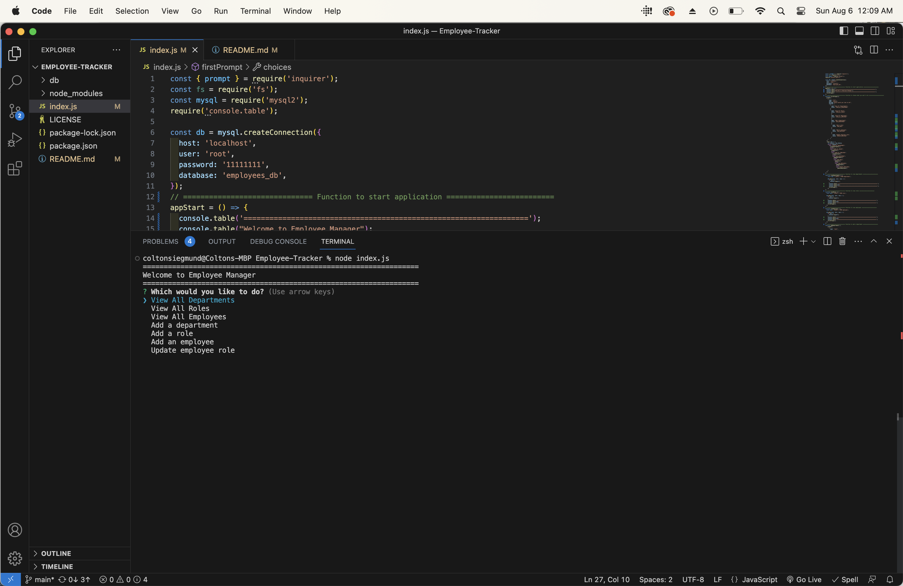

# Employee Tracker
  

  ## Description

  A command line application that helps you keep track of your employees!

  ## Table of Contents
  - [Examples](#examples)

  - [Installation](#installation)

  - [Credits](#credits)

  - [License](#license)

  - [Questions](#questions)

  ## Examples

  ## Installation
  1. Clone the repository
  2. Open it in a coding software
  3. run npm i to install packages
  4. type index.js into the command line and hit enter

  ## License
  This application is protected under the  license. Click the link to learn more.

  ## Questions
  For additional questions you can contact me at:

  GitHub: [ColtonSiegmund](https://github.com/ColtonSiegmund)

  E-Mail: [coltondrums@gmail.com](mailto:coltondrums@gmail.com)

  ## Credits
  Colton Siegmund
